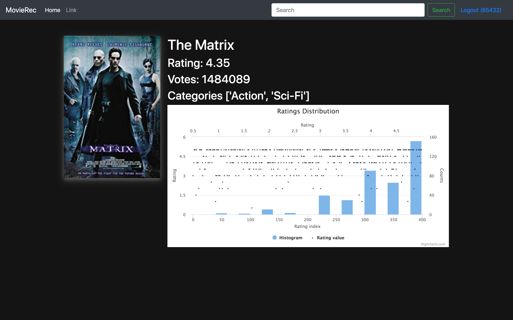

# MovieRec - A Recommendation System

This projects aims at building a movie recommendation system trained on the [MovieLens 20M database](https://www.kaggle.com/grouplens/movielens-20m-dataset). Based on previously rated movies by a users, the system recommends new movies he/she might be interested in.

This system makes use of Collaborative filtering methods to come up with recommendations for a particular user. We have used a biased version of Alternating Least Square solution to decompose the movie ratings matrix into two smaller matrices.

The model is trained using pyspark and the backend application is build using Python flask, HTML, CSS, Javascript.

We have also made use of Elasticsearch to create an inverted index for providing auto-suggestions while searching for a particular movie.

<p align="center">
  
</p>

## Requirements
1. Docker
2. Docker Compose
3. System with at least 8 Gb of RAM

## Instructions to start the server.
1. Clone this repository by executing the following command in your terminal:
```>> git clone https://github.com/amitasviper/recommendation-system```
2. Goto into this directory using the following command:
```>> cd recommendation-system```
3. Make sure that docker service is running into your system.
4. No run to bring up the containers for the recommender, execute the following command
```>> docker-compose up```

## Opening the UI
1. To open the Web UI of the application, open your favorite browser and hit the URL `http://localhost/`

<p align="center">
  
</p>

<p align="center">
  
</p>

<p align="center">
  
</p>